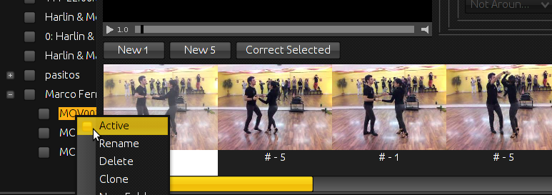

# Figurabia
A Swing GUI Application that can show dance videos and allows to "index" them to extract the positions of the dancers and be able to link between different videos with the same dancer positions. This allows a dancer to browse their videos for alternative moves in any specific position. It also enables them to see their collection of videos of dance moves visualized as a graph network.

Figurabia has three display modes (called "Perspectives"):
- Figure Editor
- Figure Explorer
- Figure Mapper

## Figure Editor

The figure editor allows to import a new video from the filesystem. Then while playing the video the user can press the "New 1" or "New 5" buttons and new "positions" will be created at the respective times in the video and will be displayed in the bottom list view.
By clicking on these list elements the user can set the movie player to the respective position in the video. Additionally the user is encouraged to add more information about the specific position of the dancers in the right upper view. In the lower part of the position item, a name can be entered to describe the transition from this to the next position (which is called an "element").

Once all information is entered the video can be activated with a right click on the video item in the left-hand list view:

## Figure Explorer

The Figure Explorer is an interface designed to browse through the videos. There are three components which all interact in a counter-clock-wise manner. In the right upper side there is the current video, with the list of positions and the one being selected that is the closest to the current position of the video.

When the video moves or the user selects a different position in the video, the dancer position info gets updated in the left upper view. Here the user can change the position and it will not affect the current video but instead affect the view in the bottom which displays all "connecting moves" of all videos.

By clicking on one of the items in the lower view, the user can jump to a different video right to the position, which is equal to the current position of the current video.

All this functionality keeps working while the video is playing, so it is possible to skip from one video to the next while keeping the whole thing playing. The player also supports slower and faster than normal speeds and even allows to play the video backwards (including sound backwards :)

## Figure Mapper

The Figure Mapper draws all figures as a graph, showing the connections between different videos. The current position has a white border around it.

The graph nodes are laid out automatically with the help of a graph layouting algorithm implemented in [JUNG](http://jung.sourceforge.net/).

